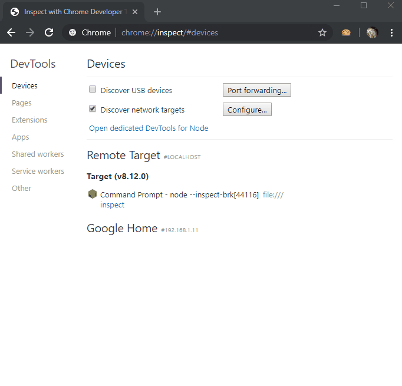
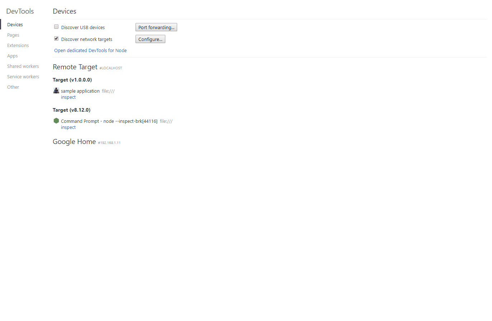

<table>
  <tr>
    <td>
      <h3> 🚨 Update (Feb 2025) </h3>
         <p> This is now archive ! the development continues here : <a href="https://github.com/kgen-llc/ChromeDevToolsConnector">Chrome DevTools Connector</a>! </p>
    </td>
  </tr>
</table>
# ChromeDevTools.Host

The library allows to host a chrome dev protocol endpoint into your own .net 4.7.2 application  or a asp.net core application.

You can then use the Chrome DevTools to explore your application. 
The idea is that th ChromeDevTools should explore the domain information and not low level data:
in case of chrome, you do not see the full set of low level TCP info or low-level C++ javascript objects details but 
the network activities or the javascript objects.
You can now do the same with your application !

# Supported feature
- [Logging support](Documentation/Logging.md)
- [Memory analysis](Documentation/MemoryAnalysis.md)
- [Scripting](Documentation/Scripting.md)
- Debugging [virtual scripts](Documentation/VirtualScript.md)

# Demo

## Samples
There is 2 samples provided :
- [EchoApp](samples/EchoApp/README.md) : a AspNetCore application
- [FwkConsoleApp](samples/FwkConsoleApp/README.md) : a more advanced sample but implemented into a regular .net console application

### **Step 1** - run the sample you want.
``` 
$ FwkConsoleApp.exe
listening on http://127.0.0.1:12345/
```

### **Step 2** - configure the port in the chrome://inspect window


### **Step 3** - explore !


# Implementation details
This is the counter part of https://github.com/BaristaLabs/chrome-dev-tools-runtime and re-use part of it (JSON definition)

- AspNet.Core is reuse the AspNet Core Middle
- FwkSelfHosted is re-use the HttpListener available in .Net Framework.
fail_on_error: true
          filter_mode: nofilter
